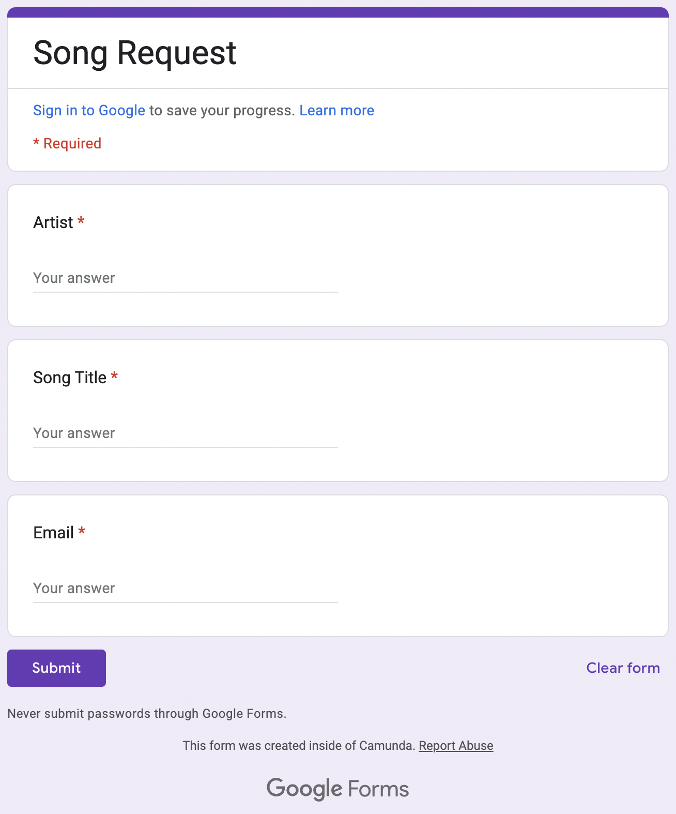

# Song Requests in Camunda 8


The focus of this example is to show how the [Camunda 8 Platform](https://docs.camunda.io) can be used to orchestrate various services together to build a useful solution. 

# Scenario / Use Case

Imagine you're planning a family reunion, a school dance, or a company retreat. You're planning to have a DJ or Band, or Karaoke. You'd like to allow your friends to recommend songs for the party. Not all your friends have Facebook, or LinkedIn, but fortunately, they all have email addresses. You'd like to invite them to submit a form with a Song Artist and Title. Some of your friends think they're witty and will probably submit silly song requests that shouldn't be added to the official list. It'd be nice to automatically determine if a song request is appropriate for the event. Also, most of your friends have very short attention spans, so in case they open the email, and then get distracted, you should also send a periodic reminders for them to send in their song request.

# My Solution

There are many ways to implement this, but here's a solution I came up with to demonstrate how Camunda 8 can be used to make this a nice experience for my friends, and also automate as much as possible, so that it's less work for me :muscle:

If everyone on my party invitation list was all on the social network, then this would be a lot easier. Unfortunately, that's not the case. For example, some of my friends and family are super active one Facebook, while others either don't even have accounts, or haven't logged on in years. But fortunately, everyone has an email address. So, I'll use [SendGrid](https://sendgrid.com/) to send email notifications to communicate with folks. In fact, I can use Camunda's [SendGrid Connector](https://docs.camunda.io/docs/components/connectors/out-of-the-box-connectors/sendgrid/) to send email notifications right from my process diagram.

Notice that this also means that there is no central system which uniquely identifies all my friends and family. I don't have the luxury of a Active Directory that contains accounts for each invitee. Luckily, Camunda is flexible enough to work around this inconvenience :wink: 

Of course, I could use [Camunda Forms](https://docs.camunda.io/docs/components/modeler/forms/camunda-forms-reference/). But since this is an demo on how to integrate different, third party services, I chose to use Google Forms. Here's what my Google form looks like: 



I need some way to communicate back to Camunda that a user has submitted a Google Form, which brings us to the most complicated part of my solution. When designing systems in general, there is usually a tradeoff between flexibility and complexity. Camunda strives to make simple things easy and difficult things possible. The simple solution here would be to use an [Inbound HTTP Webhook Connector](https://docs.camunda.io/docs/components/connectors/out-of-the-box-connectors/http-webhook/). But in this case, I chose to take advantage of a more powerful (and more complex) solution of using a custom Zeebe Client. 
 
So, I'll use a [Java Zeebe Client](https://docs.camunda.io/docs/apis-clients/java-client/]to [publish a message](https://docs.camunda.io/docs/apis-clients/grpc/#publishmessage-rpc) back to Camunda whenever someone submits a Google Form. I could have hosted my Zeebe client java project anywhere, really, but in this case, I chose to use a [Google Cloud Function](https://cloud.google.com/functions). So, I will write a small bit of javascript that will run whenever someone submits my Google Form. The javascript will trigger a Google Cloud Function which will run my Zeebe Client Java code. My Zeebe Client java code will communicate the data entered into the Google Form to the process.  

After someone submits a song request, I want to check if it's a "good" song. As I'm writing this, in March 2023, the latest buzz, of course, is all about [ChatGPT](https://chat.openai.com/)! So, I'll send each song recommendation to [OpenAI's completions Rest API](https://platform.openai.com/docs/api-reference/completions) in order to get an opinion about whether it's a good song request! This will be fun :-) 

After I hear back from the machine learning algorithm, I'll send my friends one last email notification to let them know if the song was accepted or rejected. If the AI can't tell if a song is appropriate, I'll send a note to myself to manually review the song and either approve or reject. 

# The Process Diagram

[song-requests.bpmn](src/main/resources/song-requests.bpmn)


# Fun 

Here are some funny results from OpenAI :-) 

> Hi, Dave, sorry, but your song request of 'Fight for your right' by Beastie Boys is not appropritate for this event. Here's why: No, it is not appropriate for a wedding. The song is about partying and having fun, which is not usually the atmosphere at a wedding.

# Installation and Setup

Here are the steps to see this working: 

1. Sign up for a trial account on https://camunda.io. Create a cluster and create [API Client Credentials](https://docs.camunda.io/docs/guides/setup-client-connection-credentials).
2. Edit `AppConstants.java` and add your cluster id, client id, and secret. (Note that eventually this code should be improved to use `application.properties`, but for now, these values are hard coded) 
3. Use the following command to compile and build a jar file: 
```shell
mvn clean install
```
4. If you don't have one already, create a Google Cloud Platform (GCP) account and setup the `gcloud` command line tool
5. Deploy this project as a Google Cloud Function by running the following command:
```shell
gcloud functions deploy dave-song-request-gcp-http \
  --entry-point org.springframework.cloud.function.adapter.gcp.GcfJarLauncher \
  --runtime java17 \
  --trigger-http \
  --source target/deploy \
  --memory 512MB
```
6. TODO: describe how to configure google form
7. If you don't have one already, create an OpenAI account and create an OpenAI API Key
8. Create a Camunda SaaS Secret named `SENDGRID_API_KEY` with your OpenAI API Key
9. If you don't have one already, create a Sendgrid account and create an API Key
10. TODO: describe how to configure Send grid templates
11. Create a Camunda SaaS Secret named `OPENAI_API_KEY` with your OpenAI API Key
12. Upload the `src/main/resources/song-request.bpm` file to your SaaS web modeler (or open in desktop modeler). 
13. Deploy the Song Request process to your Camunda 8 SaaS Cluster. 
14. Create the following secrets in your Camunda 8 SaaS environment.

# Start a Process Instance

Start the process by passing the name and email of a friend or family member. The process will email them and ask them to submit a request via a Google Form. 

When starting a process, pass an initial payload like this. Replace `<FRIEND_NAME>` and `<FRIEND_EMAIL>` with a friend's name and email. 

Replace `<GOOGLE_FORM_ID>` with the id of your google form. 

Also feel free to change the event type to whatever you want. Maybe a `family reunion`, or `school dance`, or `birthday party`?

```json
{
  "person": {
    "name": "<FRIEND_NAME>",
    "email": "<FRIEND_EMAIL>"
  },
  "eventType": "wedding",
  "google": {
    "form": {
      "url": "https://docs.google.com/forms/d/e/<GOOGLE_FORM_ID>/viewform?usp=sf_link"
    }
  }
}
```
```json
{
  "person": {
    "name": "Dave",
    "email": "david.paroulek@camunda.com"
  }
}
```
# Development

## Test Locally

```shell
mvn function:run
```

## Sample payload to submit Song Request

This is the data structure representing instance variables sent Google Cloud Function:

```json
{
  "messageName": "Message_formSubmitted",
  "correlationKey": "<email>",
  "formData": {
    "artist": "<artist>",
    "songTitle": "<title>"
  }
}
```

## Google Forms Apps Script

```javascript
/**
 * This is a generic function that sends data to a url which publishes a message to Camunda 8 environment. 
 * 
 * The url expects a `messageName` and `correlationKey`.
 * 
 * The `formDataJson` argument will be stored as a Camunda process variable named `formData`
 */
function publishCamundaMessage(url, camundaMessageName, correlationKey, formDataJson) {
  
  var data = {
    'messageName': camundaMessageName,
    'correlationKey': correlationKey,
    'formData': formDataJson
  };

  var options = {
    'method': 'post',
    'contentType': 'application/json',
    'payload': JSON.stringify(data)
  };

  console.log("Attempting POST");
  console.log(options);

  var response = UrlFetchApp.fetch(url, options);
  console.log(response.getContentText());
  
  return response;
}

/**
 * This is very simplistic converstion of a FormResponse to json
 */
function formResponseToJson(formResponse) {

  var result = {
    'itemResponses': []
  }

  var itemResponses = formResponse.getItemResponses();
  for (var i=0; i<itemResponses.length; i++) {
    var itemResponse = itemResponses[i];
    var answer = itemResponse.getResponse();

    var itemResponseJson = {
      'title': itemResponse.getItem().getTitle(),
      'answer': answer
    };
    result.itemResponses.push(itemResponseJson);
  }

  return result;
}

function onFormSubmit(e) {
  var formResponse = e.response;

  var url = 'https://us-central1-camunda-researchanddevelopment.cloudfunctions.net/dave-song-request-gcp-http';
  var messageName = 'Message_formSubmitted';
  var correlationKey = formResponse.getItemResponses()[2].getResponse();
  console.log(correlationKey);

  return publishCamundaMessage(url, messageName, correlationKey, formResponseToJson(formResponse));

}
```

