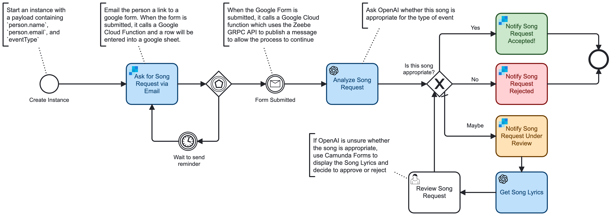

# Song Requests in Camunda 8


This is an example of how to use the [Camunda 8 Platform](https://docs.camunda.io) to collect song requests from friends before a party.

Let's say you're in charge of planning a family reunion, or a school dance. You're planning to have a DJ or Band. You'd like to allow your friends to recommend songs for the party. One simple solution is to use a Google Forms, which are convenient and really great, but you'd rather not have to manually email google form links out to everyone manually. It would also be nice to periodically remind folks to fill out the form, but you don't want to overwhelm them with emails. And it would also be cool to somehow do a sanity check on song requests and filter out anything that's not appropriate, or just not right for the party. 

Let's see how we can build this process. We'll use Camunda Platform 8 and try to make this nice experience for your friends, and also automate as much as possible so it's less work for you. 

This example shows how to orchestrate a variety of services with Camunda 8. We'll use Send grid to send an email with a link to a Google Form. We can use a Google Cloud Function to send the results back when our friends submit the form. We'll even use OpenAI to get the lyrics for songs (Karaoke!) and also do a sanity check about whether the songs are a good match for the party.

# The Process Diagram

[song-requests.bpmn](src/main/resources/song-requests.bpmn)



# Installation and Setup

Here are the steps to see this working: 

1. Sign up for a trial account on https://camunda.io. Create a cluster and create [API Client Credentials](https://docs.camunda.io/docs/guides/setup-client-connection-credentials).
2. Edit `AppConstants.java` and add your cluster id, client id, and secret. (Note that eventually this code should be improved to use `application.properties`, but for now, these values are hard coded) 
3. Use the following command to compile and build a jar file: 
```shell
mvn clean install
```
4. If you don't have one already, create a Google Cloud Platform (GCP) account and setup the `gcloud` command line tool
5. Deploy this project as a Google Cloud Function by running the following command:
```shell
gcloud functions deploy dave-song-request-gcp-http \
  --entry-point org.springframework.cloud.function.adapter.gcp.GcfJarLauncher \
  --runtime java17 \
  --trigger-http \
  --source target/deploy \
  --memory 512MB
```
6. TODO: describe how to configure google form
7. If you don't have one already, create an OpenAI account and create an OpenAI API Key
8. Create a Camunda SaaS Secret named `SENDGRID_API_KEY` with your OpenAI API Key
9. If you don't have one already, create a Sendgrid account and create an API Key
10. TODO: describe how to configure Send grid templates
11. Create a Camunda SaaS Secret named `OPENAI_API_KEY` with your OpenAI API Key
12. Upload the `src/main/resources/song-request.bpm` file to your SaaS web modeler (or open in desktop modeler). 
13. Deploy the Song Request process to your Camunda 8 SaaS Cluster. 
14. Create the following secrets in your Camunda 8 SaaS environment.

# Start a Process Instance

Start the process by passing the name and email of a friend or family member. The process will email them and ask them to submit a request via a Google Form. 

When starting a process, pass an initial payload like this. Replace `<FRIEND_NAME>` and `<FRIEND_EMAIL>` with a friend's name and email. 

Replace `<GOOGLE_FORM_ID>` with the id of your google form. 

Also feel free to change the event type to whatever you want. Maybe a `family reunion`, or `school dance`, or `birthday party`?

```json
{
  "person": {
    "name": "<FRIEND_NAME>",
    "email": "<FRIEND_EMAIL>"
  },
  "eventType": "wedding",
  "google": {
    "form": {
      "url": "https://docs.google.com/forms/d/e/<GOOGLE_FORM_ID>/viewform?usp=sf_link"
    }
  }
}
```

# Development

## Test Locally

```shell
mvn function:run
```

## Sample payload to submit Song Request

This is the data structure representing instance variables sent Google Cloud Function:

```json
{
  "messageName": "Message_formSubmitted",
  "correlationKey": "<email>",
  "formData": {
    "artist": "<artist>",
    "songTitle": "<title>"
  }
}
```

## Google Forms Apps Script

```javascript
/**
 * This is a generic function that sends data to a url which publishes a message to Camunda 8 environment. 
 * 
 * The url expects a `messageName` and `correlationKey`.
 * 
 * The `formDataJson` argument will be stored as a Camunda process variable named `formData`
 */
function publishCamundaMessage(url, camundaMessageName, correlationKey, formDataJson) {
  
  var data = {
    'messageName': camundaMessageName,
    'correlationKey': correlationKey,
    'formData': formDataJson
  };

  var options = {
    'method': 'post',
    'contentType': 'application/json',
    'payload': JSON.stringify(data)
  };

  console.log("Attempting POST");
  console.log(options);

  var response = UrlFetchApp.fetch(url, options);
  console.log(response.getContentText());
  
  return response;
}

/**
 * This is very simplistic converstion of a FormResponse to json
 */
function formResponseToJson(formResponse) {

  var result = {
    'itemResponses': []
  }

  var itemResponses = formResponse.getItemResponses();
  for (var i=0; i<itemResponses.length; i++) {
    var itemResponse = itemResponses[i];
    var answer = itemResponse.getResponse();

    var itemResponseJson = {
      'title': itemResponse.getItem().getTitle(),
      'answer': answer
    };
    result.itemResponses.push(itemResponseJson);
  }

  return result;
}

function onFormSubmit(e) {
  var formResponse = e.response;

  var url = 'https://us-central1-camunda-researchanddevelopment.cloudfunctions.net/dave-song-request-gcp-http';
  var messageName = 'Message_formSubmitted';
  var correlationKey = formResponse.getItemResponses()[2].getResponse();
  console.log(correlationKey);

  return publishCamundaMessage(url, messageName, correlationKey, formResponseToJson(formResponse));

}
```

